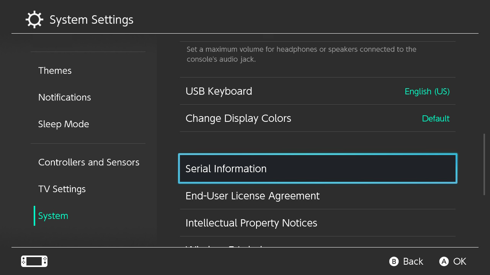

# 시작하기

### 시리얼 번호 확인하기

가장 처음 해야 할 것은 스위치에서 fusee-gelee(RCM 버그)를 사용할 수 있는지 조사해야 합니다.

fusee-gelee는 여러 스위치 해킹팀에 의해 발견된 취약점이며 2018년 6월 이후에 생산된 기기에서는 패치되었습니다. 2019년 7월에 발표된 배터리 개선형과 스위치 라이트는 세로운 프로세서 T210b01(T214, Mariko)를 사용하며 fusee-gelee가 작동하지 않습니다.

패치된 기기과 Mariko 기기는 시리얼 번호를 통해 구분할 수 있으며, 시리얼 번호는 USB 포트 옆쪽 또는 스위치 시스템 설정에서 확인할 수 있습니다. 이러한 기기에서 커스텀 펌웨어를 사용하기 위해서는 모드칩(SX Core/Lite)가 필요합니다. 

&nbsp;

!!! tip ""
    

!!! tip ""
        

&nbsp;

### 기기가 fusee-gelee를 사용할 수 있는지 확인하기

홈브류 커뮤니티들에서 fusee-gelee를 사용할 수 있다고 알려진 시리얼 번호들의 리스트를 제공합니다. 

- 만약 시리얼 번호가 "potentially patched"라면, 가이드를 진행하여 fusee-gelee를 사용할 수 있는지 확인합니다. 
- 만약 시리얼 번호가 "patched"라면 다른 취약점을 사용하거나 모드칩을 설치해야 합니다. 
- XK, XJ로 시작하는 시리얼 번호는 Mariko 기기로, 커스텀 펌웨어를 사용하기 위해서는 모드칩이 항상 필요합니다.

!!! tip "안내"
    만약 패치된 것인지 잘 모르겠다면, [이 방법](emummc/sending_payload.md)을 통해 직접 확인해볼 수 있습니다.
-----

&nbsp;

### 시리얼 목록

다음 목록은 [GBATemp 스레드](https://gbatemp.net/threads/switch-informations-by-serial-number-read-the-first-post-before-asking-questions.481215/)를 바탕으로 작성되었습니다.

|  Serial Numbers  | Unpatched | Potentially patched | Patched |
| :----|:---------------------------------|:---------------------------------|:----------------------|
| XAW1 | XAW10000000000 to XAW10074000000 | XAW10074000000 to XAW10120000000 | XAW10120000000 and up |
| XAW4 | XAW40000000000 to XAW40011000000 | XAW40011000000 to XAW40012000000 | XAW40012000000 and up |
| XAW7 | XAW70000000000 to XAW70017800000 | XAW70017800000 to XAW70030000000 | XAW70030000000 and up |
| XAJ1 | XAJ10000000000 to XAJ10020000000 | XAJ10020000000 to XAJ10030000000 | XAJ10030000000 and up |
| XAJ4 | XAJ40000000000 to XAJ40046000000 | XAJ40046000000 to XAJ40060000000 | XAJ40060000000 and up |
| XAJ7 | XAJ70000000000 to XAJ70040000000 | XAJ70040000000 to XAJ70050000000 | XAJ70050000000 and up |
| XKW1 | **N/A** | **N/A** | XKW10000000000 and up |
| XKJ1 | **N/A** | **N/A** | XKJ10000000000 and up |
| XJW1 | **N/A** | **N/A** | XJW01000000000 and up |
| XWW1 | **N/A** | **N/A** | XWW01000000000 and up |

&nbsp;

### 준비

!!! danger "주의"
    가이드를 진행하기 전에 스위치에 적어도 하나의 eShop 게임 또는 데모가 있는 것이 좋습니다. ([Onigiri](https://www.nintendo.com/games/detail/onigiri-switch/), [YouTube](https://www.nintendo.com/games/detail/youtube-switch/), [Hulu](https://www.nintendo.com/games/detail/hulu-switch/), [10 Second Run RETURNS](https://www.nintendo.com/games/detail/10-second-run-returns-switch) 등). 설치된 타이틀 대신 게임카드를 사용해도 됩니다.

&nbsp;

-----

### 버전 목록

&nbsp;

| Firmware Version | Unpatched Switches (HAC-001)    | Patched Switches (HAC-001) | "New" Switch (HAC-001-01)   | Switch Lite (HDH-001)  | 
|:-----------------|:--------------------------------|:---------------------------|:----------------------------|:-----------------------|
| 1.0.0            | Nereba 또는  [**RCM**](rcm.md)  | **N/A**                    | **N/A**                     | **N/A**                |
| 2.0.0 - 3.0.2    | Caffeine 또는 [**RCM**](rcm.md) | **N/A**                    | **N/A**                     | **N/A**                |
| 4.0.0 - 4.1.0    | Caffeine 또는 [**RCM**](rcm.md) | Caffeine 또는 SX Core      | **N/A**                     | **N/A**                |
| 5.0.0 - 12.0.1   | [**RCM**](rcm.md)               | SX Core                    | SX Core                     | SX Lite                |

&nbsp;

#### [스위치가 패치되지 않았다면, RCM으로 진행하세요. <i class="fa fa-arrow-circle-right fa-lg"></i>](rcm.md)

